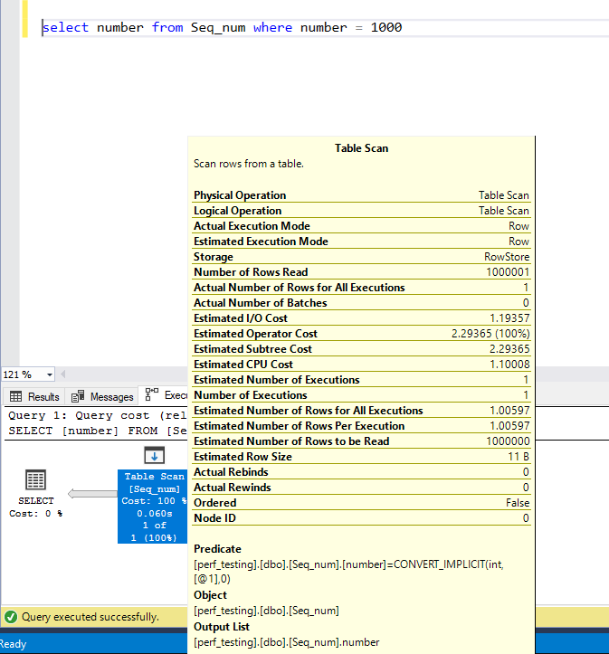

# Setting Up SQL Server database

## Running an Instance of SQL Server using docker

`docker run -e "ACCEPT_EULA=Y" -e "SA_PASSWORD=sqlserver@2017" -p 1433:1433 mcr.microsoft.com/mssql/server:2017-latest`

> This command will create a new container every time, that means the old data will not be available inside the new container, either use volume mount to persist the data or run the old container again.

## Connecting to the running docker container

`docker exec -it <container_id or container name> /opt/mssql-tools/bin/sqlcmd -S localhost -U sa -P <password>`

or you can directly connect to the Sql-server using host, username and password

## Using Sqlcmd

https://docs.microsoft.com/en-us/sql/ssms/scripting/sqlcmd-use-the-utility?view=sql-server-ver15

https://www.sqlshack.com/working-sql-server-command-line-sqlcmd/

firstly enter the commands and type go to execute it

``` plain
Example:
1> USE AdventureWorks2012;
2> GO
Database 'AdventureWorks2012' does not exist. Make sure that the name is entered correctly.
```


``` sql
-- Inserting million Row (sequential number)
;with ID as
(
    select 1 as number, 1 + cast(rand()*10000 as int) rand_number
    union all
    select number + 1, number + cast(rand()*10000 as int) rand_number
    from ID
    where number < 1000000 + 1
)
insert into Seq_num
select number--, rand_number, 'a_' + cast (number as varchar), 'b_' + cast (number/2 as varchar)
from ID  
option(maxrecursion 0)

-- https://dba.stackexchange.com/questions/130392/generate-and-insert-1-million-rows-into-simple-table
--took 25 sec to insert

```

``` sql
--inserting 1 Million Random number
insert into Rand_num
SELECT --T1.number,
    (SELECT TOP 1 T2.number as c2 FROM Seq_num T2 WHERE T2.number < 100 and T1.number IS NOT NULL ORDER BY NewID())
FROM Seq_num T1 
--where T1.number < 100

--took 3 minutes to insert
```

## Statistics in Sql Server

https://www.sqlshack.com/sql-server-statistics-and-how-to-perform-update-statistics-in-sql/


### Querying a table which is not indexed



### Checking statistics in sql server

``` sql 

-- To check the page allocations
SELECT
    rowset_id,
    allocation_unit_id,
    allocation_unit_type_desc,
    allocated_page_page_id,
    is_mixed_page_allocation,
    page_free_space_percent,
    page_type,
    page_type_desc
FROM sys.dm_db_database_page_allocations(DB_ID(N'perf_testing'), OBJECT_ID(N'ABC', N'U'), NUll, Null, 'DETAILED')

--to get io
SET STATISTICS IO on

-- to view the execution plan, without executing the query
SET SHOWPLAN_ALL on


```

### SQL Server index design
https://docs.microsoft.com/en-us/sql/relational-databases/sql-server-index-design-guide?view=sql-server-ver15

### Execution plan operators 
https://docs.microsoft.com/en-us/sql/relational-databases/showplan-logical-and-physical-operators-reference?view=sql-server-ver15


### Sql Server backup or restore status

``` sql
SELECT 
   session_id as SPID, command, a.text AS Query, start_time, percent_complete,
   dateadd(second,estimated_completion_time/1000, getdate()) as estimated_completion_time
FROM sys.dm_exec_requests r 
   CROSS APPLY sys.dm_exec_sql_text(r.sql_handle) a 
WHERE r.command in ('BACKUP DATABASE','RESTORE DATABASE') 

--Grant rights
GRANT VIEW SERVER STATE TO [Login_name] 
```